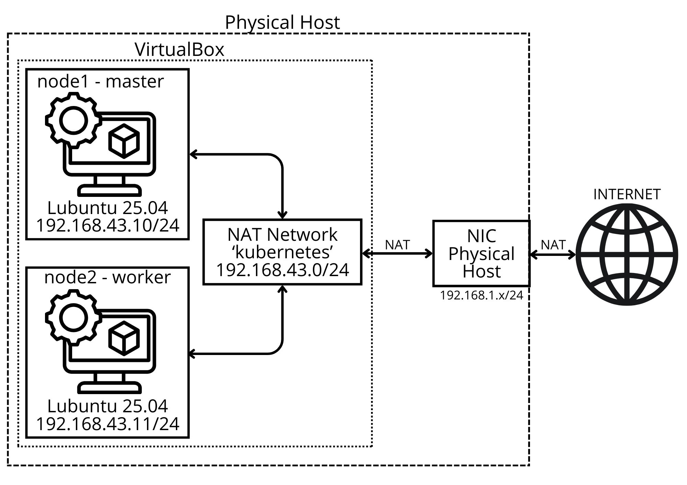

##  Kubernetes 1.34 – Features della nuova release sperimentate in ambiente locale

##  Introduzione
Questo progetto documenta la creazione e gestione di un **cluster Kubernetes v1.34** e la dimostrazione pratica delle principali novità introdotte nell’ultima release (27 agosto 2025).  

## Documentazione completa
La guida dettagliata con tutti i comandi, file YAML e configurazioni è disponibile nel file:

[`docs/manuale.pdf`](docs/manuale.pdf)




Il cluster è stato realizzato su **due Virtual Machines 'Lubuntu 25.04'**, connesse tra di loro e verso internet tramite la NAT Network di VirtualBox (kubernetes - 192.168.43.0/24):
- **node1** → Master 
- **node2** → Worker


Per l’installazione del cluster Kubernetes v1.34 è stato scelto di utilizzare kubeadm. 
Il tool kubespray, già visto a lezione, non supportava ancora ufficialmente la nuova release, causando errori nella fase di download dei pacchetti di sistema. 
kubeadm, in quanto distribuzione ufficiale di Kubernetes, ha invece garantito la compatibilità immediata con la versione 1.34, anche se è stato necessario un approcio più manuale e meno automatizzato.

---

##  Obiettivi
- Installare e configurare un cluster Kubernetes **v1.34**.  
- Mostrare con esempi pratici le **nuove funzionalità della release**, tra cui:  
  - KYAML in `kubectl`  
  - Job con `PodReplacementPolicy`  
  - ContainerRestartRules  
  - Service Topology  
  - FQDN personalizzati per Pod  
  - HPA con nuove tolleranze  
  - OpenTelemetry + Jaeger  
  - Mutating Admission Policy (CEL)  
  - Image Volume  
  - Dynamic Resource Allocation (DRA)

---

##  Prerequisiti

Per replicare il progetto servono:

- **Macchine virtuali**
  - 2 VM con **Lubuntu 25.04**  
  - `node1` (master) con IP `192.168.43.10`  
  - `node2` (worker) con IP `192.168.43.11`  
  - Rete VirtualBox impostata come **Rete con Nat** (kubernetes - 192.168.43.0/24) che permette la connessione tra di loro e verso internet

- **Configurazione di rete**
  - Modifica file `/etc/netplan/01-network-manager-all.yaml` per assegnare IP statici  
  - Aggiornamento file `/etc/hosts` e `/etc/hostname` su entrambi i nodi

- **Pacchetti di sistema**
  - `openssh-server` (per accesso remoto e chiavi SSH)
  - `python3-pip`
  

- **Kubernetes 1.34**
  - Repository ufficiale:  
    ```bash
    curl -fsSL https://pkgs.k8s.io/core:/stable:/v1.34/deb/Release.key \
      | sudo gpg --dearmor -o /etc/apt/keyrings/kubernetes-apt-keyring.gpg
    echo "deb [signed-by=/etc/apt/keyrings/kubernetes-apt-keyring.gpg] \
    https://pkgs.k8s.io/core:/stable:/v1.34/deb/ /" \
      | sudo tee /etc/apt/sources.list.d/kubernetes.list
    ```
  - Installazione pacchetti:  
    ```bash
    sudo apt install -y kubelet kubeadm kubectl
    sudo apt-mark hold kubelet kubeadm kubectl
    ```

- **Container runtime**
  - `containerd` come runtime predefinito  
  - Configurato con `containerd config default` in `/etc/containerd/config.toml`

- **Impostazioni di sistema**
  - Swap disabilitato (`swapoff -a` e modifica `/etc/fstab`)  
  - Abilitazione **IP forwarding**:  
    ```bash
    echo "net.ipv4.ip_forward=1" | sudo tee -a /etc/sysctl.conf
    sudo sysctl -p
    ```

  
 ## Versioni utilizzate

| Componente          | Versione   |
|---------------------|------------|
| Kubernetes (API)    | v1.34.0    |
| Kubeadm             | v1.34.0    |
| Kubelet             | v1.34.0    |
| Kubectl             | v1.34.0    |
| Container runtime   | containerd 2.0.5 |
| Etcd                | v3.6.4 |
| VirtualBox          | v7.1.6 |


##  Struttura della Repository

```text
├── manifests/                        # File YAML per tutte le demo di Kubernetes 1.34
│   ├── container-restart-rules.yaml     # Esempio di ContainerRestartRules
│   ├── deviceclass.yaml                 # Dynamic Resource Allocation (DeviceClass)
│   ├── fqdn-example.yaml                # FQDN personalizzato per Pod
│   ├── hpa-example-autoscaler.yaml      # HPA con nuove tolleranze
│   ├── hpa-example-deploy.yaml          # Deployment per HPA demo
│   ├── job-failed.yaml                  # Job con PodReplacementPolicy (fallito)
│   ├── job-terminating.yaml             # Job con PodReplacementPolicy (terminato manualmente)
│   ├── kyaml-example.yaml               # Output KYAML da kubectl
│   ├── mutate-add-env.yaml              # Mutating Admission Policy (CEL)
│   ├── pod-image-volume.yaml            # Image Volume (feature alpha)
│   ├── pod-image-volume-fallback.yaml   # Variante fallback con initContainer
│   ├── pod-using-claim.yaml             # Dynamic Resource Allocation (Pod con ResourceClaim)
│   ├── resourceclaim.yaml               # Dynamic Resource Allocation (ResourceClaim)
│   ├── service-topology.yaml            # Service Topology (PreferSameNode / SameZone)
│   ├── test-cluster-nginx.yaml          # Deployment di test (Nginx + BusyBox)
│   └── tracing-stack.yaml               # OpenTelemetry + Jaeger (Tracing stack)
├── img/                             # Immagini e screenshot delle demo
├── docs/                            # Manuale completo (in PDF LaTeX)
└── README.md                        # Guida introduttiva e indice delle demo
```

## Indice delle funzionalità presentate della nuova versione Kubernetes 1.34

1. **Verifica cluster con Nginx + BusyBox**  
   - Deployment di test.  
   - Verifica dei nodi e accessibilità.  

2. **KYAML Output con kubectl** (alpha – client-side, `export KUBECTL_KYAML=true`)  
   - Confronto tra output YAML classico e nuovo KYAML.  

3. **Job con PodReplacementPolicy** (stabile in v1.34)  
   - Controllo della sostituzione dei Pod nei Job (solo falliti o anche terminati manualmente).  

4. **ContainerRestartRules** (alpha – feature gate `ContainerRestartPolicy`)  
   - Regole di riavvio per container, basate sugli exit code.  

5. **Service Topology – PreferSameNode/PreferSameZone** (alpha – feature gate `ServiceTopology`)  
   - Instradamento del traffico con preferenza verso Pod locali al nodo o alla zona.  

6. **FQDN personalizzati per Pod** (stabile in v1.34)  
   - Definizione di hostname e subdomain per ottenere FQDN leggibili.  

7. **Horizontal Pod Autoscaler con nuove tolleranze** (stabile in v1.34)  
   - Scale-up rapido, scale-down prudente.  
   - Demo con stress test → scaling più stabile.  

8. **OpenTelemetry + Jaeger** (Tracing App + Kubelet) (alpha – feature gate `KubeletTracing`)  
   - Collector + Jaeger attivi con UI.  
   - Nel cluster dimostrato solo `jaeger-all-in-one`; kubelet tracing spiegato come alpha.  

9. **Mutating Admission Policy (CEL)** (alpha – feature gate `AdmissionPolicy`)  
   - Policy che aggiunge variabili ai Pod con label `env=production`.  
   - Non applicabile in kubeadm senza feature gate.  

10. **Image Volume** (OCI artifact come volume) (alpha – feature gate `ImageVolume` + runtime compatibile)  
    - Montaggio di un’immagine OCI come volume.  
    - Con `containerd` non supportato → dimostrata variante fallback con `initContainer`.  

11. **Dynamic Resource Allocation (DRA)** (alpha – feature gate `DynamicResourceAllocation` + device plugin)  
    - Introduce `DeviceClass` e `ResourceClaim` per GPU e device speciali.  
    - Solo teorico in kubeadm locale: senza plugin i Pod rimangono in stato *Pending*.  

---

## Documentazione completa
La guida dettagliata con tutti i comandi, file YAML e configurazioni è disponibile nel file:

[`docs/manuale.pdf`](docs/manuale.pdf)

---

## Autore
Daniele Angeloni - Università degli Studi di Perugia - Anno Accademico 2024/2025 - Esame di VNCC
